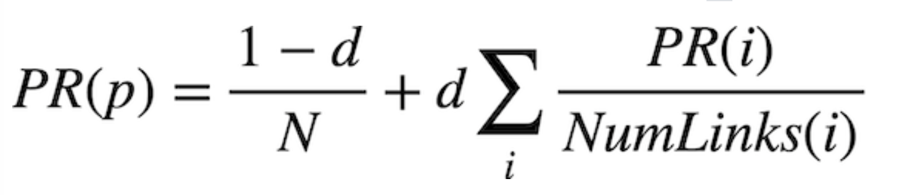

# Page-Rank Algorithm

The PageRank algorithm was created by Google’s co-founders. In PageRank’s algorithm, a website is more important if it is linked to by other important websites, and links from less important websites have their links weighted less.

In this project you can find two diffent version of the PageRank algorithm:

### 1. Random Surfer Model
The random surfer model imagines a surfer who starts with a web page at random, and then randomly chooses links to follow.
A page’s PageRank can be described as the probability that a random surfer is on that page at any given time. After all, if there are more links to a particular page, then it’s more likely that a random surfer will end up on that page. Moreover, a link from a more important site is more likely to be clicked on than a link from a less important site that fewer pages link to, so this model handles weighting links by their importance as well.

This model can be interpreted as a Markov Chain, where each page represents a state, and each page has a transition model that chooses among its links at random. At each time step, the state switches to one of the pages linked to by the current state.

Our random surfer now starts by choosing a page at random, and then, for each additional sample we’d like to generate, chooses a link from the current page at random with probability d, and chooses any page at random with probability 1 - d. If we keep track of how many times each page has shown up as a sample, we can treat the proportion of states that were on a given page as its PageRank.

### 2. Iterative Algorithm

We can also define a page’s PageRank using a recursive mathematical expression. Let PR(p) be the PageRank of a given page p: the probability that a random surfer ends up on that page. How do we define PR(p)? Well, we know there are two ways that a random surfer could end up on the page:

With probability 1 - d, the surfer chose a page at random and ended up on page p.
With probability d, the surfer followed a link from a page i to page p.
The first condition is fairly straightforward to express mathematically: it’s 1 - d divided by N, where N is the total number of pages across the entire corpus. This is because the 1 - d probability of choosing a page at random is split evenly among all N possible pages.
For the second condition, we need to consider each possible page i that links to page p. For each of those incoming pages, let NumLinks(i) be the number of links on page i. Each page i that links to p has its own PageRank, PR(i), representing the probability that we are on page i at any given time. And since from page i we travel to any of that page’s links with equal probability, we divide PR(i) by the number of links NumLinks(i) to get the probability that we were on page i and chose the link to page p.

This gives us the following definition for the PageRank for a page p.



In this formula, d is the damping factor, N is the total number of pages in the corpus, i ranges over all pages that link to page p, and NumLinks(i) is the number of links present on page i.

## Usage
The project has been developed the Python 3.9
   ```sh
   $ python3 pagerank.py corpus0

  PageRank Results from Sampling (n = 10000)
  1.html: 0.2223
  2.html: 0.4303
  3.html: 0.2145
  4.html: 0.1329

  PageRank Results from Iteration
  1.html: 0.2202
  2.html: 0.4289
  3.html: 0.2202
  4.html: 0.1307
   ```

